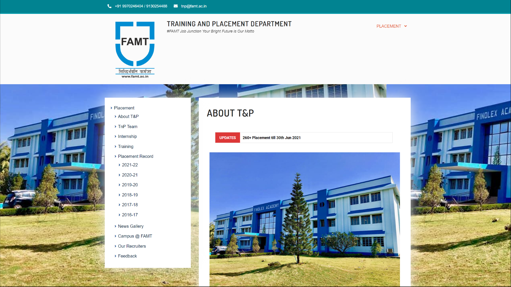
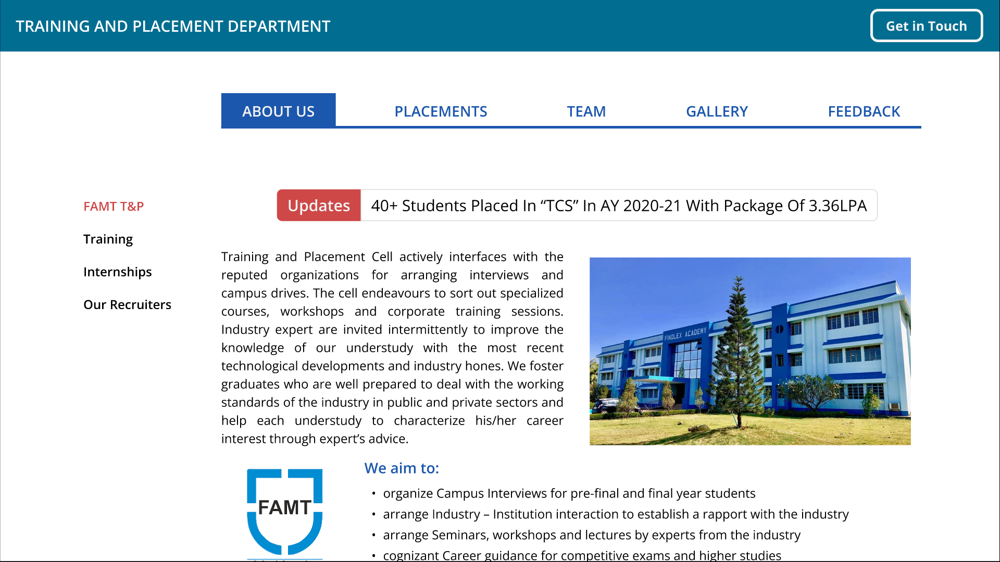
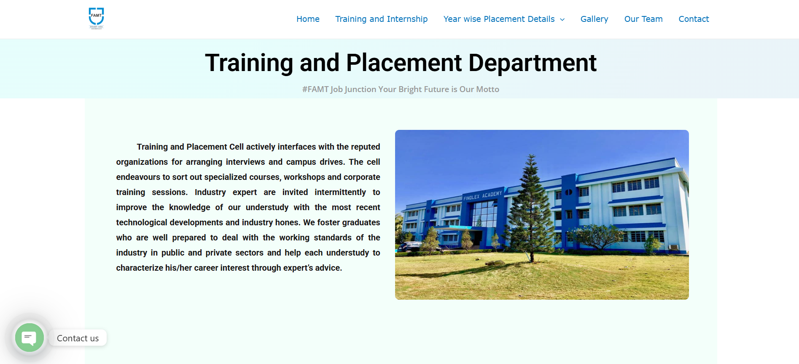
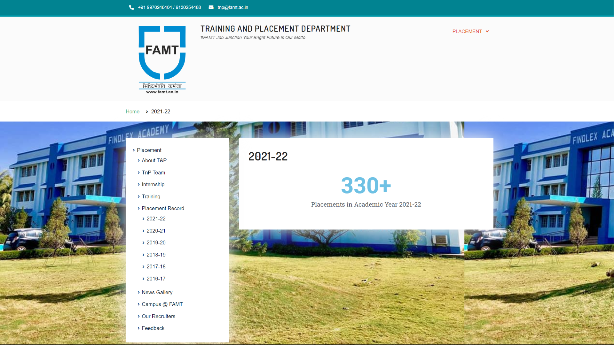
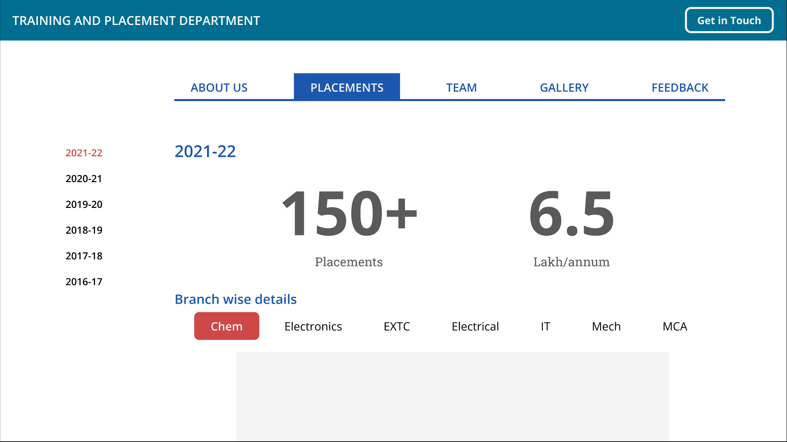
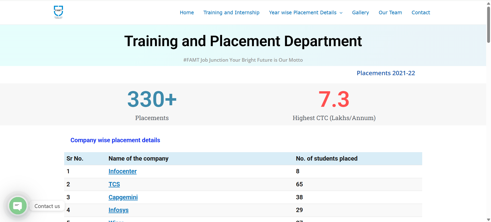
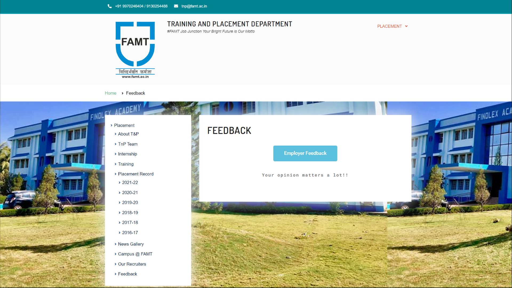
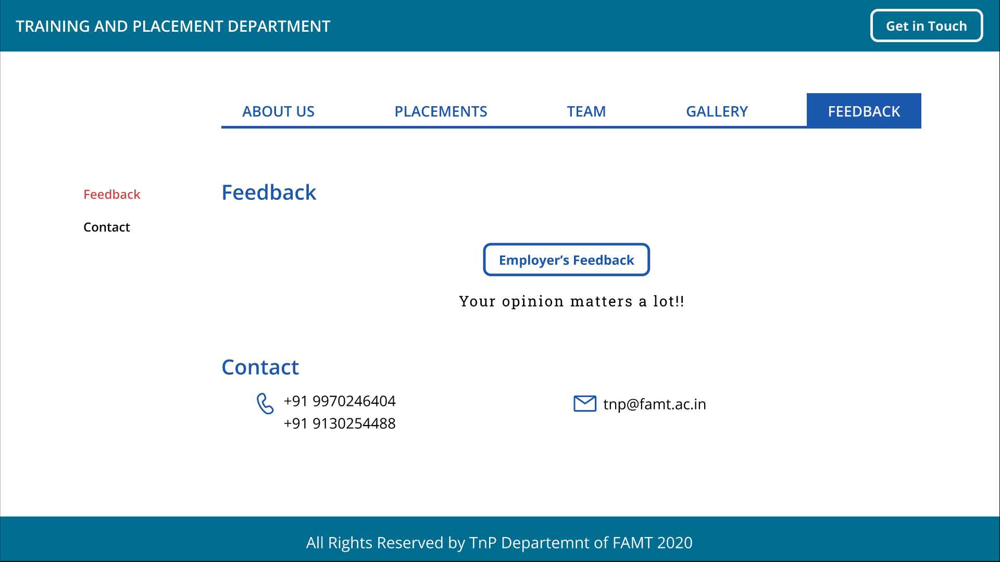
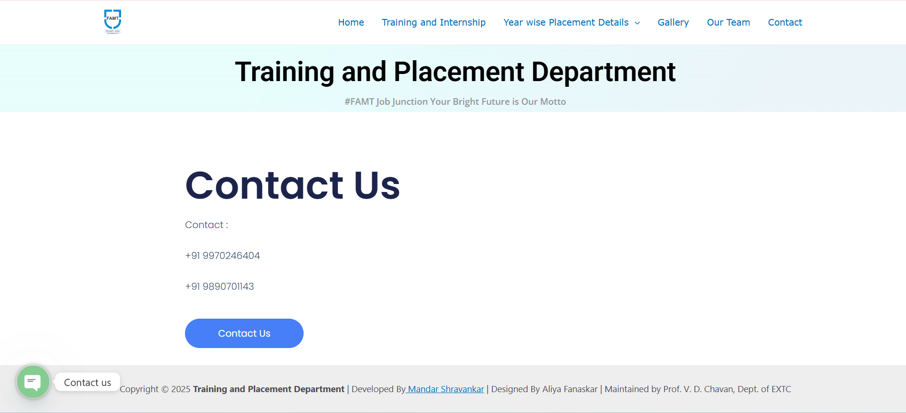

# College Website Section Redesign (UI/UX Project)

This project was completed after my Master’s final semester, when my professor recognized my **UI/UX design skills** and proposed a real-world project: **redesigning the 'Training and Placement' section of the official college website**.  

*College Name* :- **Finolex Academy of Management & Technology (FAMT), Ratnagiri, Maharashtra - 415639**

My responsibility was to design the **wireframes and interactive prototype** in **Figma**, and then hand over the design to my teammate, who implemented it using frontend technologies. The design was well-received by my professor and went into actual use.

---

## Tools & Skills
- **Figma** – Wireframing & Prototyping  
- **Design thinking with UI/UX Principles**  
- **Collaboration** – Handing off design to developer for implementation  

---

## Files in this Repository
1. [*Old UI*](1-Old_UI) → Screenshots of the previous UI of the site section
2. [*New UI*](2-New_UI) → Screenshots of the New UI of the site section created by me (Figma prototype screenshots)
3. [*Implemented*](3-Implemented) → Screenshots of the New UI of the site section implemented by developer (Official website screenshots)\

---

## Preview Screens
Here are a few sample screens from the redesign:  

<table align="center">
  <tr>
    <th width="30%">Old UI</td>
    <th width="30%">New UI (proposed)</td>
    <th width="30%">New UI (Implemented)</td>
  </tr>
  <tr>
    <td></td>
    <td></td>
    <td></td>
  </tr>
  <tr>
    <td></td>
    <td></td>
    <td></td>
  </tr>
  <tr>
    <td></td>
    <td></td>
    <td></td>
  </tr>
</table>

## Links
You can view Figma UI prototypes here
* Prototype of Old Design - [View Prototype](https://www.figma.com/proto/eixb8LWmpMB3Mgwdn8Xnvs/FAMT-Placements?node-id=4-37&p=f&t=LTVRjR71zMe5FcZV-1&scaling=contain&content-scaling=fixed&page-id=0%3A1&starting-point-node-id=4%3A37&show-proto-sidebar=1)
* Prototype of New Design - [View Prototype](https://www.figma.com/proto/eixb8LWmpMB3Mgwdn8Xnvs/FAMT-Placements?node-id=32-548&p=f&t=LTVRjR71zMe5FcZV-1&scaling=contain&content-scaling=fixed&page-id=0%3A1&starting-point-node-id=32%3A548&show-proto-sidebar=1)
* College Official website - [FAMT - Training and Placement Department](https://famt.ac.in/tnp/)

---

## Project Highlights
- Improved **navigation flow** and **visual hierarchy**.  
- Created a clean and **student-friendly layout**.  
- Ensured **handoff-ready design** with style guidelines.  
- First-hand experience in **real-world academic project execution**.  

---

## Acknowledgment
Special thanks to my Sir [Prof. Kishor Bhosale](https://www.linkedin.com/in/kishor-bhosale-943b3617) for trusting me with this opportunity, and to my teammate [Mandar Shravankar](https://www.linkedin.com/in/mandarshravankar/)  for implementing the design in code.  

